class: title-slide, middle, center


```{r mathjax, child='./library/mathjax2tex.Rmd'}
```


```{r setup, include=FALSE}
options(htmltools.dir.version =FALSE)
knitr::opts_chunk$set(echo = TRUE, fig.align = "center")
```

```{r xaringan-panelset, echo=FALSE}
xaringanExtra::use_panelset()
```

```{r xaringan-tile-view, echo=FALSE}
# Press 'O' to Overview the slides
xaringanExtra::use_tile_view()
```

```{r xaringan-editable, echo=FALSE}
xaringanExtra::use_editable(expires = 1)
```

```{r xaringan-fit-screen, echo=FALSE}
xaringanExtra::use_fit_screen()
```

```{r, echo=FALSE}
# press w to turn the webcam on and off, or press Shift + W to move the video to the next corner. You can also drag and drop the video within the browser window.
xaringanExtra::use_webcam()
```


```{r functions, include=FALSE}
# A function for captioning and referencing images
fig <- local({
    i <- 0
    ref <- list()
    list(
        cap=function(refName, text) {
            i <<- i + 1
            ref[[refName]] <<- i
            paste("图 ", i, ": ", text, sep="")
        },
        ref=function(refName) {
            ref[[refName]]
        })
})
```

#### .green[大数据时代统计教学与科研能力提升的思考与探讨]
&nbsp;


## 工欲善其事，必先利其器
### 数据科学与文学化统计编程

### .red[`r Sys.Date()`]
&nbsp;
&nbsp;


<!--
个人介绍: 
华东师范大学教授，博士生导师，《Statsitical Theory and Related Fields》执行主编，《应用概率统计》和《华东师范大学学报》编委,中国数学会概率统计学会、中国运筹学会可靠性分会、中国现场统计研究会计算统计分会、上海市工业与应用数学会理事，主持并完成国家自然科学基金3项，其他各类项目20多项，在国内外学术刊物上发表论文100多篇，著有《R语言与统计分析》、《可靠性统计》、《贝叶斯统计》。
-->

<!--
题目: 大数据时代R新生态与文学化统计编程
摘要: 
大数据时代数据科学成为一个非常时髦的交叉学科，这为统计学及相关专业的学生带来了更大的挑战和更好的就业机会。开源时代为我们提供了许多免费的优秀工具，如专注于数据统计分析与可视化的R语言、轻量级的标记语言markdown和精美图书排版工具TeX。R与Markdown的联姻诞生了R Markdown, 使得数据分析与写作融为一体,有效权衡标准化与个性化,极大提升学习与教学的效率。本报告从一个统计学专业老师的角度讲述文学化统计编程的心得，展示一些使用rmarkdown的实际例子。 从这个通俗的报告中你可学会如何快速高效地做笔记、写书、写毕业论文、制作幻灯片等技巧。

本报告适合人群：喜欢数据科学的老师，研究生、本科生与数据从业人员。
-->

---
class: clear, middle, center


&nbsp;

&nbsp;

# .blue[数据科学与文学化统计编程]
### .center[汤银才]
#### .center[[yctang@stat.ecnu.edu.cn](yctang@stat.ecnu.edu.cn)]
#### .center[[华东师范大学统计学院](http://stat.ecnu.edu.cn)]


---

layout: true

<div class="my-header"></div>       
<div class="R-footer"></div>       

---
class: metroheader

<!--
中国历史上十大商人 儒商鼻祖——子贡,被孔子称为“瑚琏之器”的人
http://www.henanrushangwang.com/newsx.asp?id=471
-->

# Motivation: 怎么修养仁德？(《论语: 卫灵公》)

.pull-left[

- ### 子贡问为仁

- ### 子曰：“工欲善其事，必先利其器。居是邦也。事其大夫之贤者，友其士之仁者。

]

.pull-right[
```{r, echo = FALSE, out.width = "100%"}

```
]

.center[.font200[.red[工以利器为助]]]

---
class: metroheader

# 怎么修养仁德？

.pull-left[
```{r, echo = FALSE, out.width = "100%"}

```
]

.pull-right[
```{r, echo = FALSE, out.width = "100%"}

```
]

.center[.font200[.red[人以贤友为助]]]


---
class: metroheader

# 思考问题？

* # 标准化*，.red[要？] 

--

* # 个性化，.red[怎么做？]

--

- # 标准化基础上的个性化，.red[可落地！]

--

- # 赋能教学与科研. .red[能否/怎么做？]

> .small[朱建平2019大数据统计分会报告]

---
class: metroheader

#  提纲

```{r echo=FALSE}
xaringanExtra::style_panelset_tabs(
  active_foreground = "#0051BA",
  hover_foreground = "#d22",
  font_family = "Roboto"
)
```

.panelset[
.panel[.panel-name[数据科学与编程语言]

.content-box-red[
1. 数据科学

1. 数据分析师的成长历程

1. R新生态与我们要感谢的人

]]


.panel[.panel-name[文学化统计编程基础]

.content-box-blue[
.blue[
1. 掌握Rstudio/VS Code

2. 精通R Markdown

3. Quarto: 新一代的Rmarkdown

]]
]

.panel[.panel-name[文学化统计编程实践]

.content-box-red[

1. 示例1: 用Rmarkdown做Slides

2. 示例2: 用Rmarkdown写书

3. 示例3: 用Rmarkdown写毕业论文


]]

]


---
class: title-slide, middle, center

# Part I. 数据科学与编程语言

<div style='float:left'></div>
<hr color='#EB811B' size=5px width=720px>


---
class: title-slide, middle, center

## 1. 数据科学

---
class: metroheader

# 数据科学: 计算机，统计，机器学习

.pull-left[
```{r, echo = FALSE, out.width = "75%", fig.cap=fig$cap("","数据科学(传统定义)")}
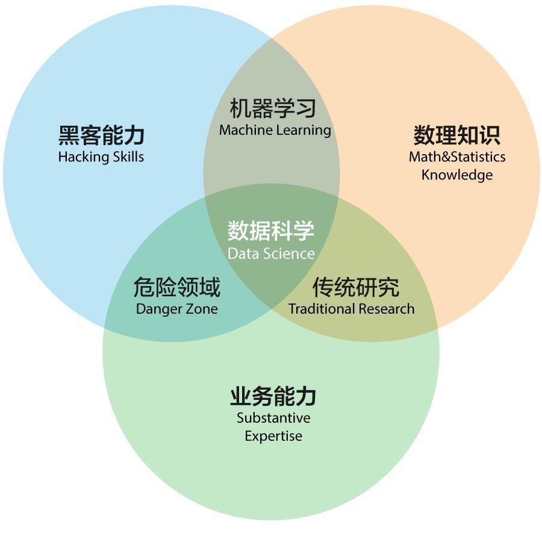
```
]

--

.pull-right[
```{r, echo = FALSE, out.width = "65%", fig.cap=fig$cap("","计算机，统计，机器学习的关系*")}
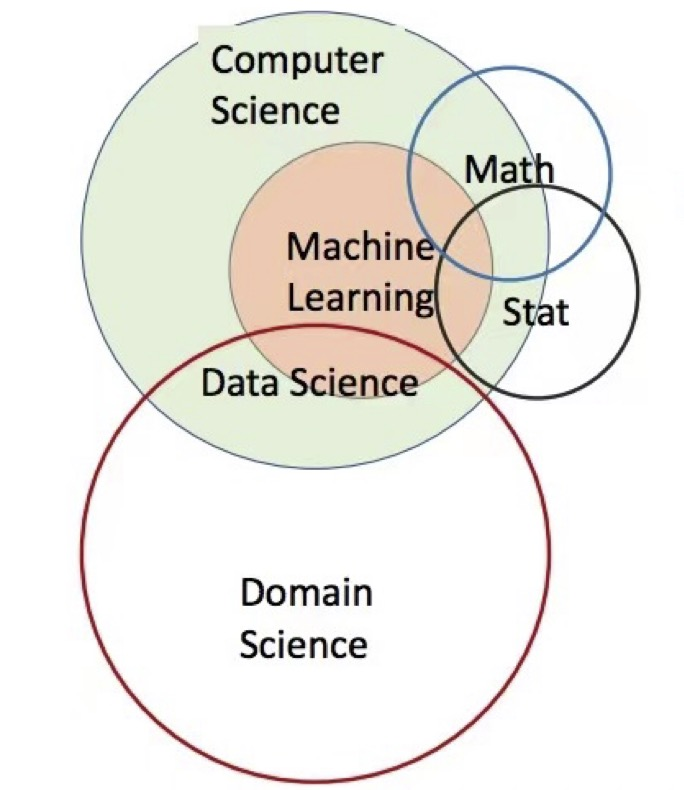
```
]

> Jeffrey D. Ullman (2020图灵奖获得者), The Battle for Data Science, Bulletin of the IEEE Computer Society Technical Committee on Data Engineering

---
class: title-slide, middle, center

## .yellow[编程语言的选择?]


---
class: metroheader

# 编程/分析工具应具备的品质

.pull-left[

- ### 极易入门(基本功能简单)

- ### 费用低廉(免费)

- ### 代码开放/开源(共享)

- ### 无平台限制(共享)

- ### 求助方便
]
--
.pull-right[
- ### 良好生态与社区

- ### 数据分析高效(工具包)

- ### 可视化容易而强(工具包)

- ### 编程能力强(可扩展性)

- ### 有卓越的IDE

]

---
class: metroheader

# .yellow[过去]与.yellow[现在]的统计软件

.pull-left[
- Excel

- .red[SAS] (好贵，好重)

- .red[Matlab]

- SPSS

- Minitab

- Fortran

- Eviews

- Stata
]

--
.pull-right[
- ### .content-box-red[R]

- ### .content-box-red[Python]

- ### .content-box-red[Julia]

]

---
class: metroheader

# 三大开源语言: R, Python, Julia

--
```{r, echo = FALSE, out.width = "65%", fig.cap=fig$cap("","编程语言性能比较(相对于C=1.0)")}
knitr::include_graphics("./loc-figs/HPC-julia2.png")
```

---
class: metroheader

# R与Python的比较

.pull-left[
1. R 是一种.red[解释性程序语言]，更加专注于统计建模与数据分析
1. 拥有丰富的.red[统计计算]和.red[数据可视化]工具/包
1. R语言的社区和开源生态系统非常活跃，CRAN、Github、Biconductor的开源包已经超过.red[2万]
1. 轻松地处理大型数据集和矩阵(借助data.table,future,purrr,furrr等包)
1. 借助data.table, dplyr, tidyr, 实现和Python的pandas媲美的高速数据处理能力
1. 缺点1: .red[学习曲线陡峭]，需要一定的统计学和编程知识
1. 缺点2: .red[效率相对较低]
]

--

.pull-right[
1. Python 是一种.red[通用的编译语言]，既可用于Web开发，又可用于机器学习
1. 拥有丰富的.red[数据处理、机器学习、深度学习]库
1. Python的社区和开源生态系统也非常活跃，有大量的开源库(.red[12万])，涵盖网络爬虫、自动化、数据分析与可视化、WEB开发、机器学习、自然语言处理等众多领域
1. 支持多线程和分布式计算，可更好地处理大规模数据集
1. 拥有更多的库(如NumPy和Pandas等)，可以实现更加高效的编程
1. 学习曲线相对较平缓，易于学习
1. 缺点: .red[统计计算和数据可视化工具稍显不足]
]


---
class: metroheader

# R vs Python, 选择?


```{r, echo = FALSE, out.width = "85%",fig.cap=fig$cap("","数据科学二大编程语言PK")}
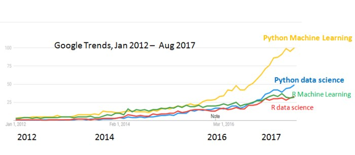
```

[更多比较见 Datacamp: When Should I Use Python vs. R?](PythonvsR.pdf)

---
class: metroheader

# .yellow[就业]: 美国招聘岗位需求统计(2017年11月)

```{r, echo=FALSE, out.width = "40%",fig.cap=fig$cap("","编程语言与就业")}
knitr::include_graphics("./loc-figs/PYorR-job.jpg")
```

---
class: metroheader

# R vs. Python, 选择?

.pull-left[
- ### 当前主流的数据分析语言

  - ### .content-box-green[R: 倚天剑]

  - ### .content-box-red[Python: 屠龙刀]
]

--
.pull-right[

- ### 个人建议:

  - ### .content-box-green[统计学院: R为主]

  - ### .content-box-red[工程类学院: Python为主]

]

---
class: title-slide, middle, center


## 2. 数据分析师的成长历程 

---
class: metroheader

# 数据分析的流程

```{r, echo=FALSE, out.width = "80%",fig.cap=fig$cap("","数据分析的流程")}
knitr::include_graphics("./loc-figs/ds-communicate.png")
```

[] 图片来源: R for Data Science(
Hadley Wickham, Garrett Grolemund)


---
class: metroheader

# Level 1 - 仅使用RGUI

```{r, echo=FALSE, out.width = "90%",fig.cap=fig$cap("","数据分析师-L1")}
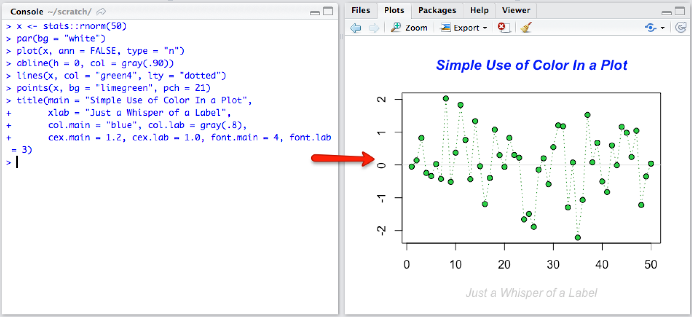
```

---
class: metroheader

# Level 2 - 使用 Rstudio


```{r, echo=FALSE, out.width = "50%",fig.cap=fig$cap("","数据分析师-L2")}
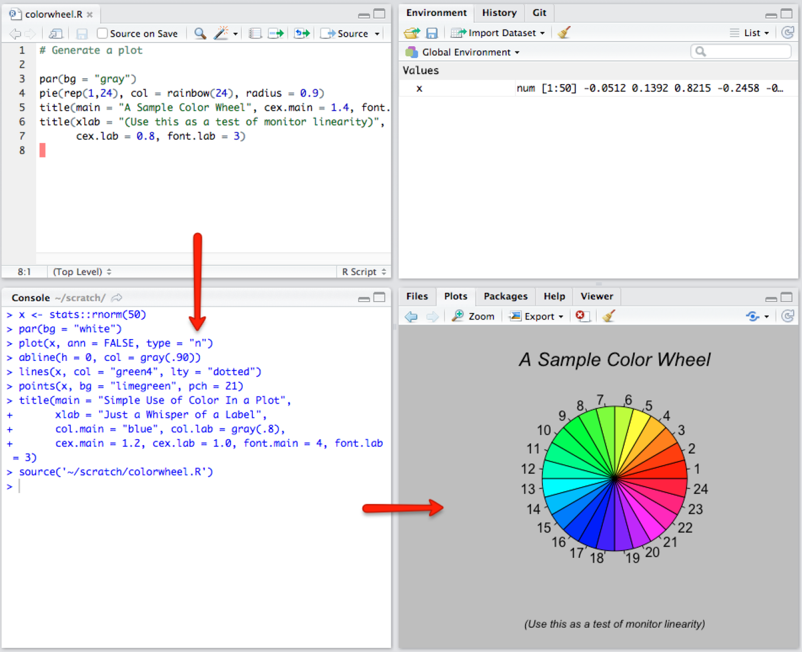
```


---
class: metroheader

#  Level 3 - 使用 Rmarkdown (Rstudio中)

```{r, echo=FALSE, out.width = "85%",fig.cap=fig$cap("","数据分析师-L3")}
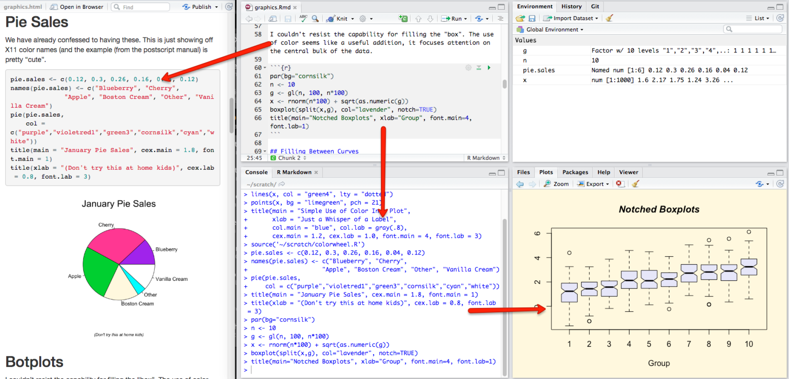
```

---
class: metroheader

#  大数据时代数据分析人才应具备的素质

.pull-left[

- ### 统计思维

- ### 算法思维

- ### 数据思维

- ### 交叉思维
]

--

.pull-right[

- ### 创新意识

- ### 团队/协同精神

- ### 提问能力

- ### 写作, 逐步被AI取代

]


---
class: title-slide, middle, center

## 3. R新生态与我们要感谢的人！

---
class: metroheader

# R的创始人

.left-column[
```{r, echo=FALSE, out.width = "70%"}

```
]

```{r, echo=FALSE, out.width = "60%"}

```


---
class: metroheader

# Hardley Wickham (COPSS Presidents' Award, 2019)

- [一个改变了 R的人](https://zhuanlan.zhihu.com/p/77570704)， [主页](http://hadley.nz/)


.column-left[
```{r, echo=FALSE, out.width = "95%"}

```
]
.column-center[

```{r, echo=FALSE, out.width = "75%"}
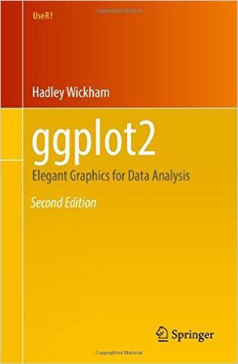
```
]

.column-right[

```{r, echo=FALSE, out.width = "78%"}
knitr::include_graphics("./loc-figs/Hardleybook2.png")
```
]


---
class: metroheader

# Hardley Wickham: packages created

```{r, echo=FALSE, out.width = "100%"}
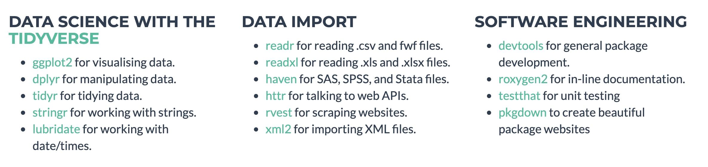
```

```{r, echo=FALSE,eval=FALSE}
library(cranlogs)
cran_downloads()
cran_downloads(package = c("ggplot2", "dplyr", "rmarkdown", "bookdown"))
#cran_top_downloads()
#cran_downloads(when = "last-week")
```
```r
library(cranlogs)
cran_downloads(package = c("ggplot2", "dplyr", "rmarkdown", "bookdown"))
        date count   package
1 2023-04-04 95653   ggplot2
2 2023-04-04 74297     dplyr
3 2023-04-04 43852 rmarkdown
4 2023-04-04  1836  bookdown
```


---
class: metroheader

# 谢益辉 (2009 John M. Chambers Award)

- [随机漫步十八年的傻瓜](https://www.iqiyi.com/v_19rsij7aew.html)
- knitr, animation, bookdown, blogdown, pagedown, xaringan, tinytex, DT, tufte, formatR, fun, mime, highr, servr, Rd2roxygen 作者


.column-left[
```{r, echo=FALSE, out.width = "80%"}

```
]

```{r, echo=FALSE, out.width = "66%"}
knitr::include_graphics("./loc-figs/yihuibooks.jpg")
```


---
class: title-slide, middle, center

# Part II. 文学化统计编程基础

<div style='float:left'></div>
<hr color='#EB811B' size=5px width=720px>

---
class: title-slide, middle, center

## .yellow[写作工具的选择?]


---
class: metroheader

# Markdown

.pull-left[
1. ### 一种轻量级标记语言，它可以用于快速编写结构化文档

1. ### 语法简单易懂，可以用于排版文本、插入链接、插入图片等

1. ### 主流的平台几乎都使用/支持
]

--

.pull-right[

- .red[ChatGPT]
- Github
- .red[Rstudio]
- .red[VS code]
- Jupyter Notebook
- Stack Overflow
- Notion/.red[NotionAI]
- .red[Typora] (推荐使用)
- 简书
]  


---
class: metroheader

# 两大武器

#### 1. Rstudio: 无所不包的平台(IDE) 

  - 语法高亮显示
  - 代码自动补全
  - 支持UTF-8编码
  - 支持Rmd/Qmd, 实现可视化编程(新版本2023.03.0) 

#### 2. R Markdown: 几乎万能的(文学化写作)工具 
  
  - 完美整合R，$\TeX$ 和 Markdown
  - 将文字(text)与代码(code) 编织(knitr)在一起产生各种美观的输出格式，实现理想的.blue[文学化统计编程]

.content-box-red[
*Your data tells a story. Tell it with R Markdown. Turn your analyses into high quality documents, reports, videos and dashboards.*
]


---
class: middle, center, title-slide

## 1. 掌握Rstudio

---
class: metroheader

#  Rstudio介绍  

.pull-left[
- 优秀的代码编辑器
  
- 可.red[成倍成倍]提高数据分析的效率
  
- 最好的跨平台R IDE，基本窗口:

    - 左上: 源代码编辑器(source)
    - 左下: 代码运行窗口(console)
    - 右下: 图形显示(plots)
    - 右上: 工作空间(workspace)
]

.pull-right[
```{r, echo = FALSE, out.width = "85%", fig.align='center',fig.cap=fig$cap("","Rstudio界面")}
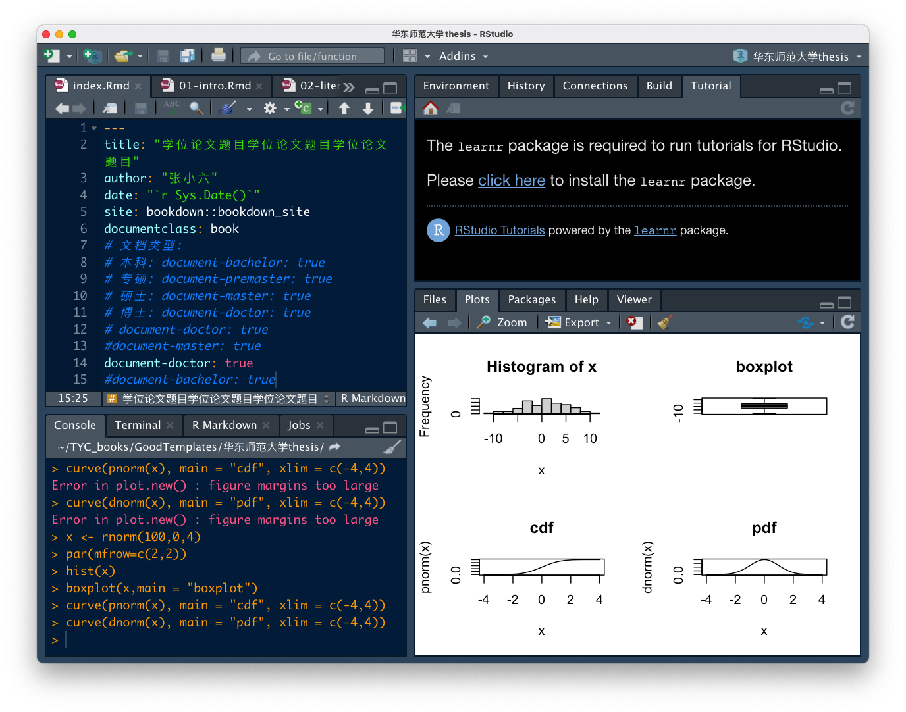
```
]

- 集成多个R Markdown文档类型/模板(报告、书稿、期刊、幻灯、博客)，实现与R的动态交互
- 通过rmarkdown/knitr进行高效的文学化统计编程
- 根据需要定制窗口(布局，颜色)

---
class: metroheader

# Console窗口(左下) 

.pull-left[
- 栏目/功能:
  - Console: 运行R代码
  - R Markdown: 返回R Markdown文档运行过程
  ]

.pull-right[
```{r, echo = FALSE, out.width = "100%"}
knitr::include_graphics("./loc-figs/rstudio-console.png")
```
]

- 主要优点：
  - R代码自动补全(Tab触发) 
  - 获取历史命令(up, control/CMD + up触发)

- 交互式debugger (已运用到chunk中)
    
---
class: metroheader

# Source窗口(左上)

- R代码编辑器
```{r, echo = FALSE, out.width = "50%"}
knitr::include_graphics("./loc-figs/rstudio-source-1.png")
```

- Rmd/Qmd文档编辑器
```{r, echo = FALSE, out.width = "50%"}
knitr::include_graphics("./loc-figs/rstudio-source-2.png")
```

> 不同文档对应的菜单布局略有差异

  
---
class: metroheader

# Source窗口 

### R代码

- 语法高亮显示
- 代码自动补全
- 个性化定制: 
   - 代码个性化设置
   - 编辑窗口主题(theme)及输出窗口进行(layout)设置
- 管理多个源文件(标签页设计)
- 注释与缩进：保持编写R代码的良好风格; 使用 Ctrl+Shift+C 切换注释
- 快速执行代码: 
   - Ctrl+Enter: 执行当前一行或选中多行代码
   - Shift+Ctrl+Enter: 执行整个代码块

---
class: metroheader

# Source窗口 

.pull-left[

- 分段与折叠
  - 函数自然分段
  - R文档分段符：任何4个以上“-”，“=”，“#”结尾的注释行
  - Rmd文档分段: 代码块(chunk)和段落标题

- 导航栏可快速切换！
  - 试试: 点击编辑器窗口左下侧
]

.pull-right[
```{r, echo = FALSE, out.width = "100%", fig.cap = "导航栏切换"}
knitr::include_graphics("./loc-figs/rstudio-aviation.png")
```
]

---
class: metroheader

# Workspace窗口 (右上)

```{r, echo = FALSE, fig.align='center', out.width = "50%", fig.cap = "Workspace窗口"}
knitr::include_graphics("./loc-figs/rstudio-workspace.png")
```

栏目/功能:

- Environment: 
  - 查看工作空间
  - 导入数据集
- History: 
  - 查看运行的历史纪录
  - To Console: 将代码送到Console运行
  - To Source: 将代码送到Source窗口光标位置处
- Presentaion: R Presentation的结果预览窗口  

---
class: metroheader

# Plot窗口 (右下)

栏目/功能:

- Viewer: 预览R Markdown文档编辑后的结果

```{r, echo = FALSE, fig.align='center', out.width = "50%"}
knitr::include_graphics("./loc-figs/rstudio-plot-1.png")
```


- Plots: 显示R绘图结果

```{r, echo = FALSE, fig.align='center', out.width = "50%"}
knitr::include_graphics("./loc-figs/rstudio-plot-2.png")
```

- Packages： R包管理器(安装，加载，更新)

```{r, echo = FALSE, fig.align='center', out.width = "50%"}
knitr::include_graphics("./loc-figs/rstudio-plot-3.png")
```

- Files: 当前工作目录中文件(Console中的小箭头也可转到Files)
- Help: 显示R的帮助


---
class: middle, center, title-slide

## 2. 精通R Markdown

---
class: metroheader

# R Markdown背后的核心技术

1. Rstudio: 最优秀的文学化统计编程器
  
1. knitr: Rstudio的最佳组合

  - 源于sweave包
  - 动态生成报告的R包, 喻为.blue[大象]
  - 助力文学化统计编程
  - 支持多种输入语言(如 R, Python)和输出markup语言 (如TeX, HTML, Markdown)

- [Pandoc](http://pandoc.org)

  - 万能文档格式转换器，喻为瑞士军刀
  - 支持html, pdf, LaTeX， Word，Markdown 等文档格式的互相转换


---
class: metroheader

#  R Markdown[](http://rmarkdown.rstudio.com)呈现形式/类型

.pull-left[
- [R Markdown](http://rmarkdown.rstudio.com) 支持多个静态与动态的输出格式

  - HTML, PDF, Word
  - Beamer, HTML5 slides
  - books
  - scientific articles/journal papers
  - dashboards, shiny applications
  - websites

- 均集成在Rstudio中

]

--

.pull-right[
```{r, echo=FALSE, out.width = "80%",fig.cap=fig$cap("","R Markdown呈现形式")}
knitr::include_graphics("./loc-figs/rmd-2.png")
```
]


---
class: metroheader

# 动态预览

- R markdown文件在Rstudio中支持内建预览
  - 数学公式
  - R代码结果
  - 生成图形
  - 生成表格
  - 多图形R代码输出循环

- 两种模式(类似Typaro)
  - Source模式
  - Visual模式

---
class: metroheader

# R Markdown 写作流程

1. 在Rstudio中建一个 R Markdown 文档（.rmd/.qmd文件）
2. 编辑Rmd文档(使用markdown语法)
  - 标题
  - 斜体和加粗字体
  - 无序列表，有序列表
  - 超链接(图片，网址)
  - 使用.red[chunk环境]写R代码
3. 点击按钮“Knit”实现文档转换生成HTML/pdf/doc格式
  - "knit to HTML"
  - "knit to pdf"
  - "knit to word"  

---
class: metroheader

# Knitr流程

```{r, echo=FALSE, out.width = "60%"}
knitr::include_graphics("./loc-figs/rmarkdownflow.png")
```

```{r, echo=FALSE, out.width = "60%",fig.cap=fig$cap("","knitr流程")}
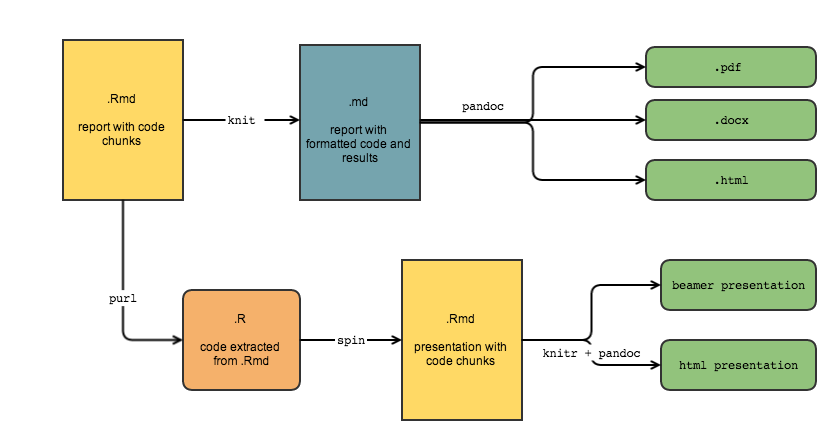
```


???
Knitr将Rmd中的TeX和R翻译生成标准的Markdown文档(.md)，再经XeLaTeX引擎生成pdf文件.


---
class: metroheader

# R Markdown文档的构成

.left-column[

1. YAML头片段
1. md文本: 标题，列表，超链接，粗斜体，...
1. R/Python代码
  - 行间代码(代码块)
  - 行内代码
  - 非执行R/python代码块(高亮)
  - 代码抄录
1. HTML CSS整体定制文件 
1. 嵌入到特定页面的HTML
  - 插图: `` (图片来源、大小、位置等)
  - 特定元素: 线条、换行
]

.right-column[

```{r, echo = FALSE, out.width = "100%",fig.cap=fig$cap("","xaringan模板中的YAML片段")}
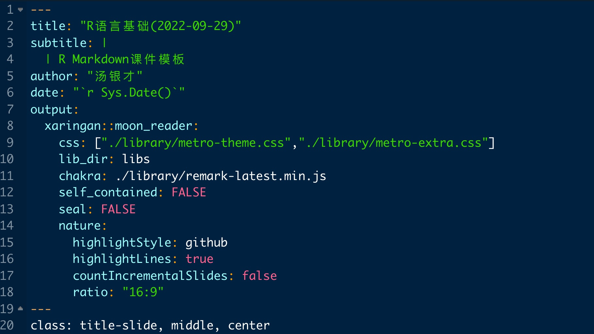
```

-  `metro-theme.css`, `metro-extra.css` 为`xaringan`下外部CSS式样文件

]


---
class: metroheader

# 公式示例

- 行中公式: $\hat\mu = \frac{1}{n}\sum_{i=1}^n x_i $

- 独立行公式:
.content-box-purple[
$$\hat\mu = \frac{1}{n}\sum_{i=1}^n x_i $$
]

- 多行公式
\begin{align}
x & =  \cos(t) \\
y & =  \sin(t) \label{eq-2}
\end{align}

- 引用:  根据公式\eqref{eq-2}. 


---
class: metroheader

# R 图形输出

.pull-left[
```{r eval=FALSE, fig.height=3}
par(mar = c(4, 4, 1, .1))
fit = lm(dist ~ 1 + speed, 
         data = cars)
plot(cars, pch = 19, 
     col = 'blue', las = 1)
abline(fit, lwd = 2)
```
]

--

.pull-right[
```{r, echo=FALSE, eval=TRUE, fig.height=3, fig.cap=fig$cap("","R图形: 回归分析")}
par(mar = c(4, 4, 1, .1))
fit = lm(dist ~ 1 + speed, 
         data = cars)
plot(cars, pch = 19, 
     col = 'blue', las = 1)
abline(fit, lwd = 2)
```
]


---
class: metroheader

# Python 图形输出

.pull-left[
```{r, echo=TRUE}
library(reticulate)
```
```{python, echo=TRUE, eval=FALSE}
import matplotlib.pyplot as plt
import numpy as np
t = np.arange(0.0, 2.0, 0.01)
s = 1 + np.sin(2*np.pi*t)
plt.plot(t, s)
plt.grid(True)
plt.show()
plt.close("all")
```
]

--

.pull-right[
```{python, echo=FALSE, out.width = "80%"}
import matplotlib.pyplot as plt
import numpy as np
t = np.arange(0.0, 2.0, 0.01)
s = 1 + np.sin(2*np.pi*t)
plt.plot(t, s)
plt.grid(True)
plt.show()
plt.close("all")
```
]


---
class: metroheader

# R 图形输出(面板)

.panelset[
.panel[.panel-name[R Code]

```{r regline, fig.show='hide'}
library(ggplot2)
ggplot(Orange) +
  aes(x = age, y = circumference, colour = Tree) +
  geom_point() +
  geom_line() +
  guides(colour = "none") +
  theme_bw()
```
]

.panel[.panel-name[Plot]


]

.panel[.panel-name[解释]

散点图与回归线表示:

- 汽车的行驶距离与速度密切相关

- 并成线性增长趋势

]

]


---
class: metroheader

#  R Shiny
.pull-left[
```{r,  echo=FALSE, out.width = "83%", fig.cap=fig$cap("","R Shiny gif 图-1")}
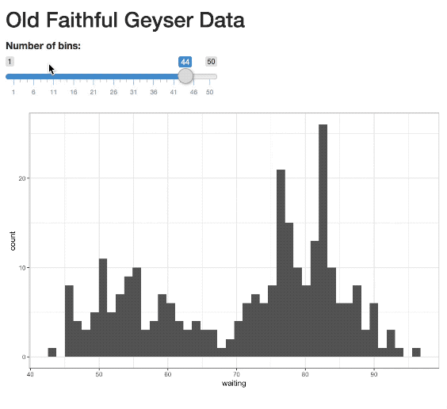
```
]

.pull-right[
```{r,  echo=FALSE, out.width = "85%", fig.cap=fig$cap("","R Shiny gif 图-2")}
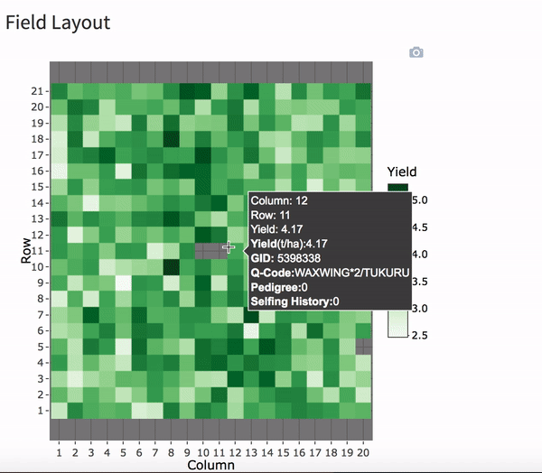
```
]

---
class: metroheader

# 插入本地图片

```{r, eval = FALSE, out.width = "40%"}
knitr::include_graphics("./loc-figs/Rlogo.png")
```


.pull-left[
```{r, echo = FALSE, out.width = "65%", fig.cap=fig$cap("","本地图片:R logo")}
knitr::include_graphics("./loc-figs/Rlogo.png")
```
]
.pull-right[
```{r, echo = FALSE, out.width = "50%", fig.cap=fig$cap("","本地图片: Python logo")}

```
]


---
class: metroheader

# 表格: kable

```{r eval=require('knitr'),tidy=FALSE,comment=""}
kable(head(iris,8), format = "html", caption = "Title of the table")
```


---
class: metroheader

# 代码块选项

- knitr对代码的处理通过其中的选项控制

- chunk的全局选项放在`opts_chunk@set()`中，例如全局设置

```{r, echo=FALSE, out.width = "80%", fig.align='left'}
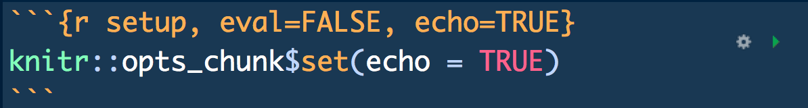
```

- 例子

```{r, echo=FALSE, out.width = "80%", fig.align='left'}
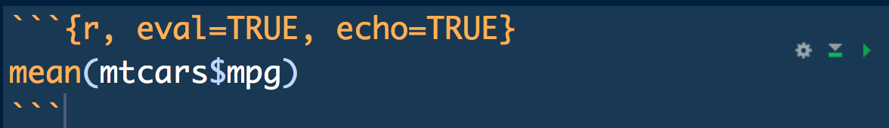
```

---
class: metroheader

# 常用chunk选项

.large[
|选项|取值|含义  |
|:----|:----:|:------|
| eval | TRUE; FALSE | 执行或不执行代码|
| echo|  TRUE; FALSE | 显示/隐藏源代码|
| warning|  TRUE; FALSE | 显示/隐藏警告文本|
| error|  TRUE; FALSE | 错误消息 |
| emssage|  TRUE; FALSE |是否保留message()给出的消息|
| tidy|  TRUE; FALSE | 代码重排, 由formatR包支持|
| prompt|  TRUE; FALSE | 是否在R代码中添加代码|
| comment|  '##'; 字符串 | 在R代码前添加注释符|
| fig.width| 数字, 英寸  | 设置图形的宽度与高度|
| fig.height| 数字, 英寸 | 设置图形的宽度与高度|
]

---
class: middle, center, title-slide

## 3. Quarto: 新一代的Rmarkdown

---
class: metroheader

# 认识Quarto

- 与Rmarkdown类似

- 功能更加强大和灵活，适用于各种数据分析和机器学习等领域的应用场景

- 支持多种输出格式，如PDF、HTML、LaTeX等

- 支持自定义CSS、JavaScript和LaTeX模板

- 支持 .red[R, Python，Julia，JavaScript Observable] 等其他编程语言的.red[代码块]，从而具有更强的扩展性
  
- 支持VS Code, Rstudio (支持可视化编程)

---
class: metroheader

# Quarto出版项目

```{r, echo=FALSE, out.width = "80%", fig.align='left'}
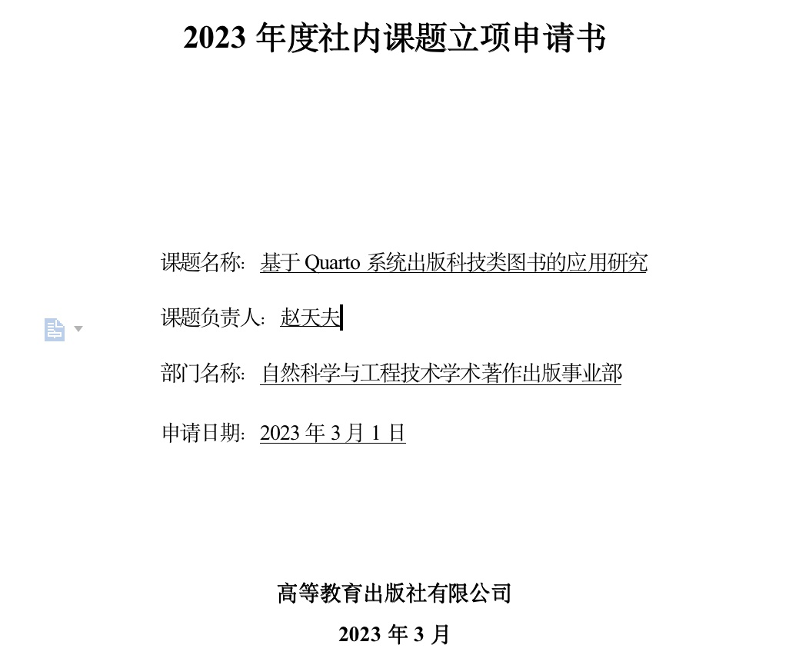
```


---
class: title-slide, middle, center

# Part III. 文学化统计编程实践

<div style='float:left'></div>
<hr color='#EB811B' size=5px width=720px>

---
class: metroheader

# github上开源了我开发的所有模板(17个)

- [ECNU-Stat-templates](https://github.com/tangyc8866/ECNU-Stat-templates)

.pull-left[
### 类型: 
  - TeX模板
  - Rmarkdow模板
  - Bookdown模板
  
### 场景:
  1. 案例分析报告
  2. 期刊模板
  3. Slides模板(4:3, 16:9)
  4. 本科/研究生/硕士/博士生毕业论文模板
  5. 自科基金模板
]

.pull-right[
```{r, echo=FALSE, out.width = "80%", fig.align='left'}
#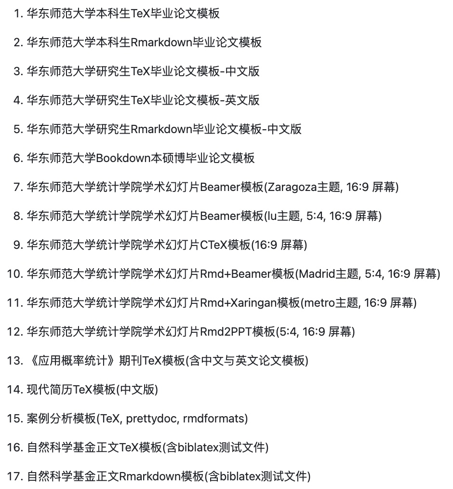

```

]


---
class: title-slide, middle,center

# 示例1: 用Rmarkdown写Slides

---
class: title-slide, middle,center

# 示例2: 用Rmarkdown写书

#### [Bookdown中文书稿写作手册](https://tangyc8866.github.io/bookdown_tutorial/index.html)

```{r, echo = FALSE, out.width = "20%"}

```

---
class: title-slide, middle,center

# 示例3: 用Rmarkdown写毕业论文

---
class: title-slide, middle, center


<br>
<br>
<br>
<br>

# 谢谢！

<br>


#### 本幻灯片由 .red[xaringan] 生成


